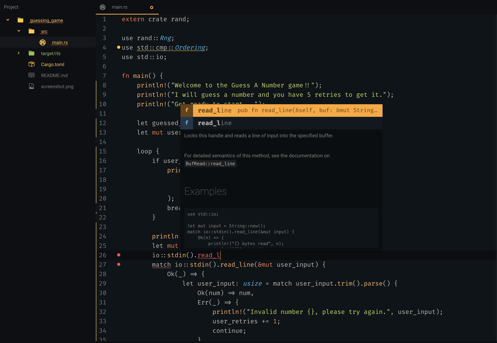
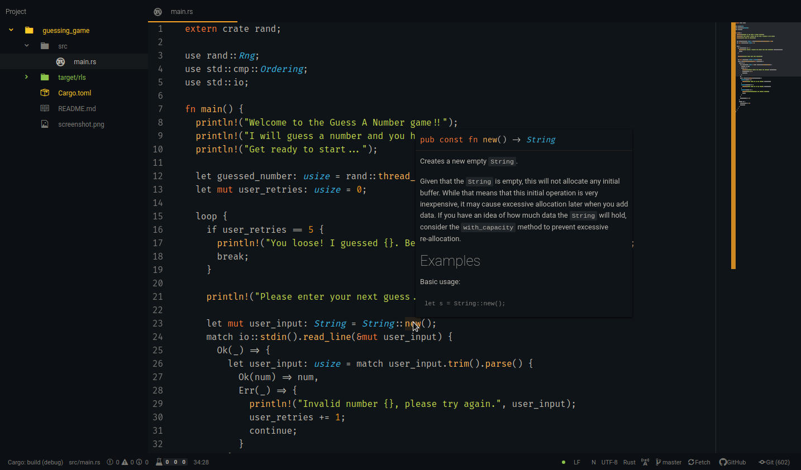
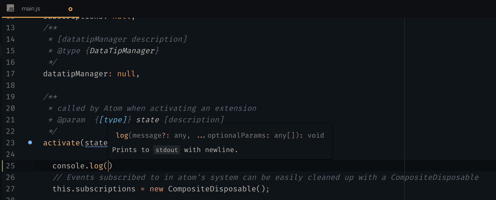
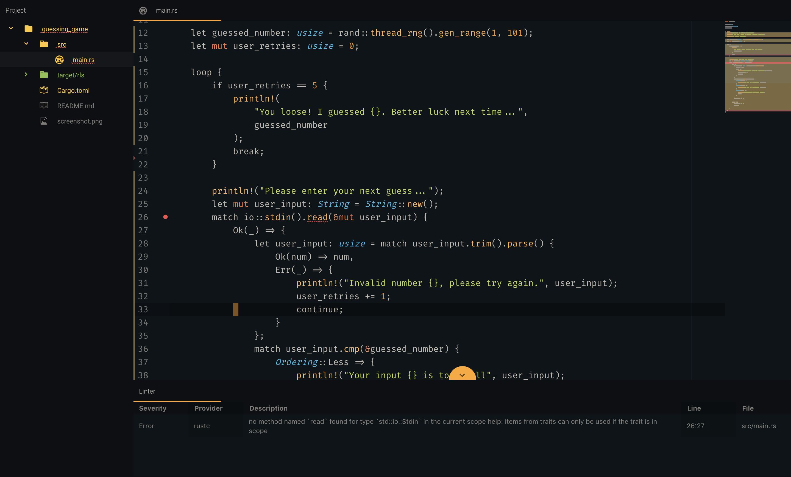

---
# Feel free to add content and custom Front Matter to this file.
# To modify the layout, see https://jekyllrb.com/docs/themes/#overriding-theme-defaults

layout: default
---
## Objective

The original objective of the Facebook [Nuclide](https://nuclide.io) / [Atom-IDE](https://ide.atom.io) project has been to provide extension packages for the [Atom Editor](https://www.atom.io) to interact with custom Language Servers via the [Language Server Protocol](https://langserver.org) to enable IDE like functionality in our beloved editor.

The original package was made of various "subpackages" that provide the overall functionality and were always build and released in a monolithic extension (aka atom-ide-ui).

The objective of this project is to take over the concepts and ideas in the original atom-ide-ui package, but provide individual extensions that can be developed, released and installed independently.

We will start with the most important features, and iterate on them quickly to come on par with the functionality available in the atom-ide-ui package.

## Getting Started

So far, there have been a few features from the original atom-ide-ui package that have been created as individual packages. Here are the steps required to start using IDE features in your Atom Text Editor using the new community packages.

1. Install an IDE language package that you would like to use:
* TypeScript & JavaScript [ide-typescript](https://atom.io/packages/ide-typescript)
* HTML [ide-html](https://atom.io/packages/ide-html)
* CSS, LESS, SCSS [ide-css](https://atom.io/packages/ide-css)
* Python [ide-python](https://atom.io/packages/ide-python)
* Rust [ide-rust](https://atom.io/packages/ide-rust)
* You can also search for [packages](https://atom.io/packages/search?q=IDE) in Atom.

  **IMPORTANT: When you are asked if you want to install the atom-ide-ui dependency by one of those packages, you usually can deny doing so**

  **HINT: some of these packages also require you to install additional tools on your computer, such as the ide-rust package requires a current rls toolchain, or python the python-language-server package. Please check the installation instruction of the ide-packages for more details on the requiremens.**

2. Install the [Busy-Signal](https://atom.io/packages/busy-signal) package that is uses by some of the existing ide-packages to show running background tasks

3. Install any of the [community packages](https://atom.io/users/atom-ide-community) listed below.

4. Enjoy!

## Atom IDE Community Packages

### AutoComplete

Once you have installed an IDE language package, this should work right away.

{:width="100%"}

### [Data Tip](https://atom.io/packages/atom-ide-datatip)

A replacement of the DataTip functionality from atom-ide-ui. When you hover over a symbol in your code (or move your cursor to it), it can show you details about that symbol in a tool tip. [More details](https://github.com/atom-ide-community/atom-ide-datatip#atom-ide-datatip-package)

{:width="100%"}

### [Signature Help](https://atom.io/packages/atom-ide-signature-help)

A replacement of the signature help functionality from atom-ide-ui. When you're calling a function, it can help you understand the parameters or information about the function you’re calling. [More details](https://github.com/atom-ide-community/atom-ide-signature-help#atom-ide-signature-help)

{:width="100%"}

### [Go to Definition](https://atom.io/packages/atom-ide-definitions)

A replacement of the go to definition functionality from atom-ide-ui. [More details](https://github.com/atom-ide-community/atom-ide-definitions#atom-ide-definitions-package)

### Linter / Linter-UI

There is an existing [linter](https://atom.io/packages/linter) and [linter-ui](https://atom.io/packages/linter-ui-default) that is known to work with the existing ide-packages. It can be configured to only show linting errors per file, or for the whole project in its settings.

{:width="100%"}

## Roadmap

We have published our current roadmap on [Github](https://github.com/atom-ide-community/atom-ide-community.github.io/issues/3#issue-424527067) for you to check and provide feedback to us.
